# Hive-Ngram-Analysis
This repository contains a Hive project to analyze Google Books n-grams dataset. This project demonstrates how to install and deploy Hive on a local Hadoop pseudo-distributed cluster, merge data files on HDFS, compute average occurrences of each bigram per year, and identify the top 20 bigrams by their average yearly occurrences.

## Task 1 Hive安装部署

### Step 1 下载并解压Hive安装包

首先需要下载Hive安装包文件， [Hive官网下载地址](http://www.apache.org/dyn/closer.cgi/hive/)，并执行以下操作进行解压：

```shell
sudo tar -zxvf ./apache-hive-3.1.3-bin.tar.gz -C /usr/local   # 解压到/usr/local中
cd /usr/local/
sudo mv apache-hive-3.1.3-bin hive       # 将文件夹名改为hive
sudo chown -R hadoop:hadoop hive            # 修改文件权限
```

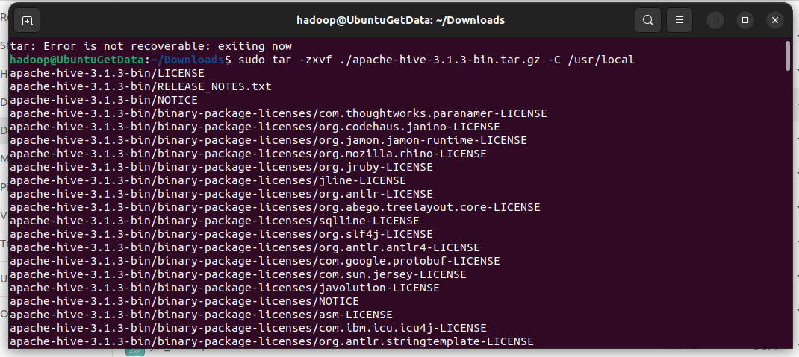

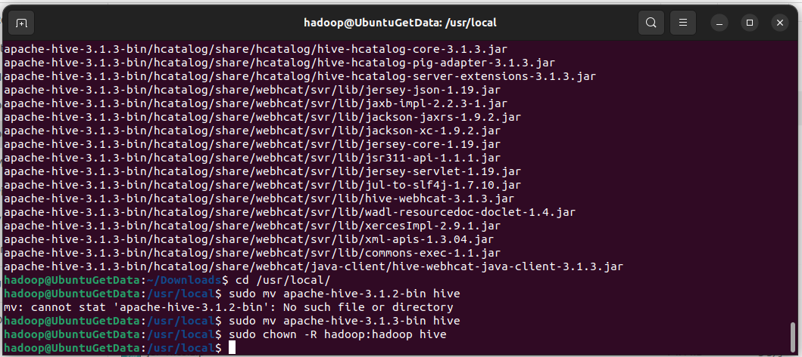

### Step 2 配置环境变量

为了方便使用，把hive命令加入到环境变量中去，使用vim编辑器打开.bashrc文件，命令如下：

```shell
vim ~/.bashrc
```

在该文件最前面一行添加如下内容：

```shell
export HIVE_HOME=/usr/local/hive
export PATH=$PATH:$HIVE_HOME/bin
export HADOOP_HOME=/usr/local/hadoop
```

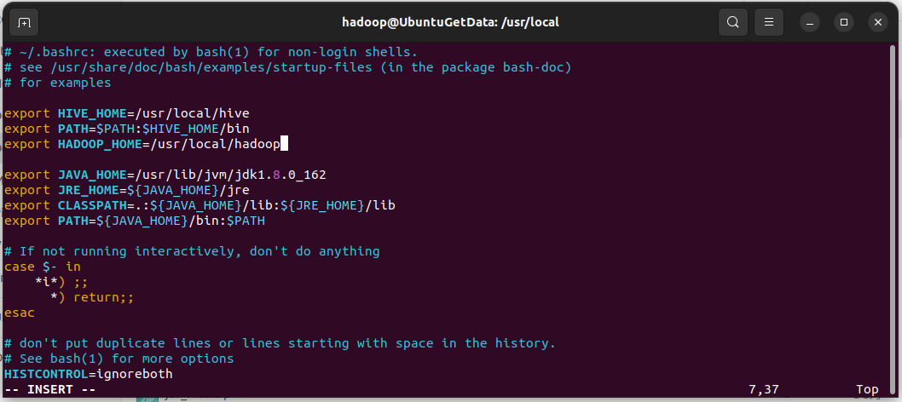

HADOOP_HOME需要被配置成你机器上Hadoop的安装路径，比如这里是安装在/usr/local/hadoop目录。
保存退出后，运行如下命令使配置立即生效：

```bash
source ~/.bashrc
```

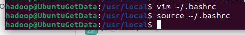

### Step 3 修改`/usr/local/hive/conf`下的hive-site.xml

执行如下命令：

```bash
cd /usr/local/hive/conf
mv hive-default.xml.template hive-default.xml
```

上面命令是将hive-default.xml.template重命名为hive-default.xml；

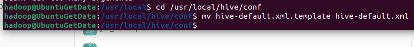

然后，使用vim编辑器新建一个配置文件hive-site.xml，命令如下：

```bash
cd /usr/local/hive/conf
vim hive-site.xml
```

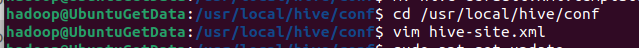

在hive-site.xml中添加如下配置信息：

```
<?xml version="1.0" encoding="UTF-8" standalone="no"?>
<?xml-stylesheet type="text/xsl" href="configuration.xsl"?>
<configuration>
  <property>
    <name>javax.jdo.option.ConnectionURL</name>
    <value>jdbc:mysql://localhost:3306/hive?createDatabaseIfNotExist=true</value>
    <description>JDBC connect string for a JDBC metastore</description>
  </property>
  <property>
    <name>javax.jdo.option.ConnectionDriverName</name>
    <value>com.mysql.jdbc.Driver</value>
    <description>Driver class name for a JDBC metastore</description>
  </property>
  <property>
    <name>javax.jdo.option.ConnectionUserName</name>
    <value>hive</value>
    <description>username to use against metastore database</description>
  </property>
  <property>
    <name>javax.jdo.option.ConnectionPassword</name>
    <value>hive</value>
    <description>password to use against metastore database</description>
  </property>
</configuration>
```

然后，按键盘上的“ESC”键退出vim编辑状态，再输入:wq，保存并退出vim编辑器。

### Step 4 安装mysql和JDBC包

使用以下命令即可进行mysql安装，注意安装前先更新一下软件源以获得最新版本：

```bash
sudo apt-get update  #更新软件源
sudo apt-get install mysql-server  #安装mysql
```

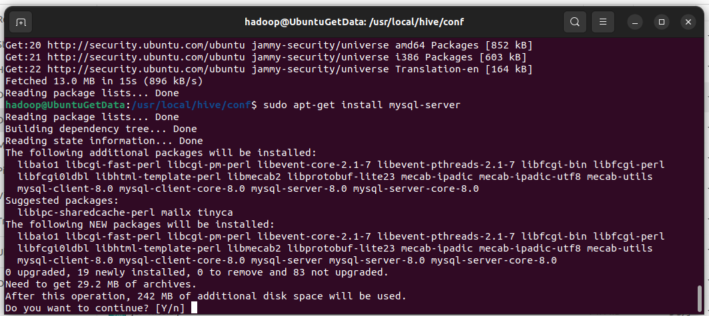

启动mysql服务器：

```bash
service mysql start
```

确认是否启动成功，mysql节点处于LISTEN状态表示启动成功：

```bash
sudo netstat -tap | grep mysql
```

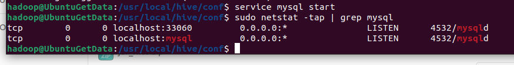

下载JDBC 驱动程序，复制到Hive的lib目录：

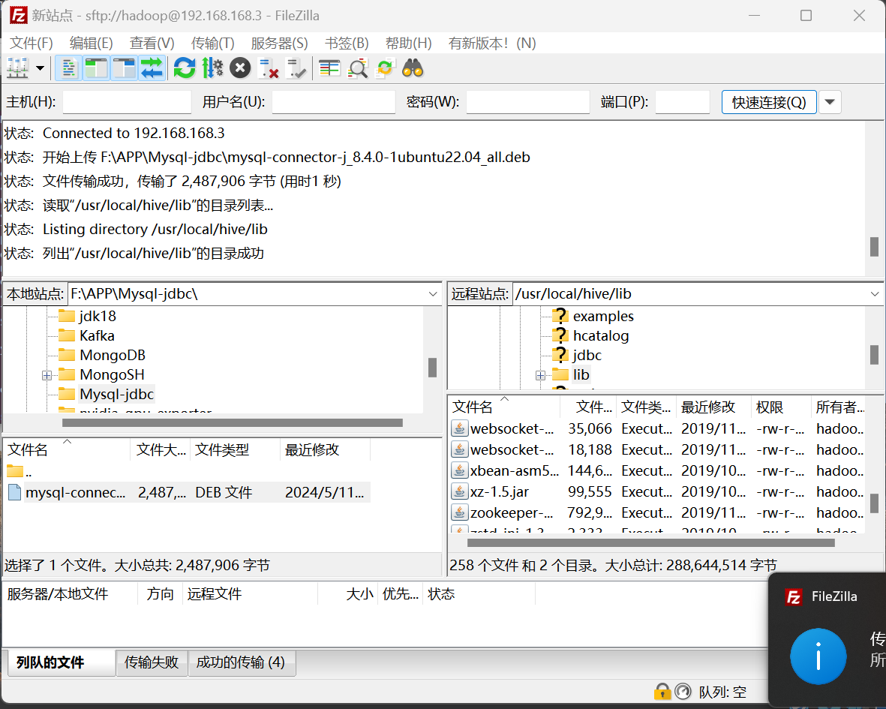

### Step 5 启动并登陆mysql shell


```shell
service mysql start #启动mysql服务
mysql -u root -p  #登陆shell界面
```

新建hive数据库

```mysql
create database hive;    #这个hive数据库与hive-site.xml中localhost:3306/hive的hive对应，用来保存hive元数据
```

配置mysql允许hive接入：

```mysql
create user 'hive'@'localhost' identified by 'hive';
grant all on *.* to 'hive'@'localhost';   #将所有数据库的所有表的所有权限赋给hive用户，后面的hive是配置hive-site.xml中配置的连接密码
flush privileges;  #刷新mysql系统权限关系表
```

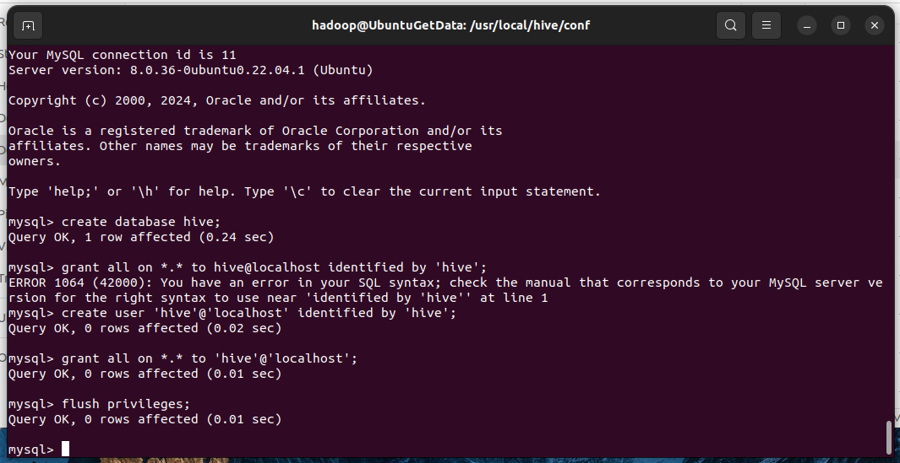

### Step 6 启动hive

启动hadoop和hive

```bash
cd /usr/local/hadoop #进入Hadoop安装目录
./sbin/start-dfs.sh
cd /usr/local/hive
./bin/hive
```

发生报错：

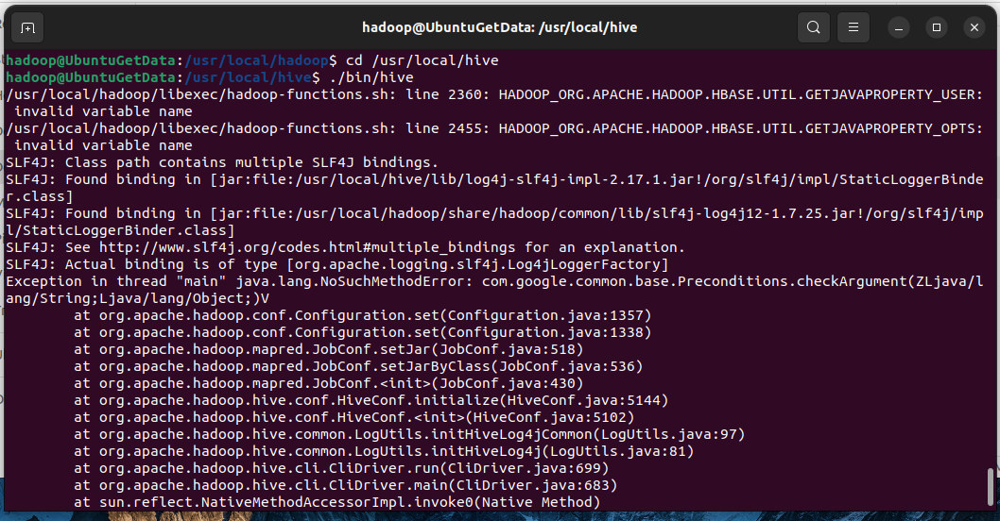

【错误】

java.lang.NoSuchMethodError: com.google.common.base.Preconditions.checkArgument

【原因】

com.google.common.base.Preconditions.checkArgument 这是因为hive内依赖的guava.jar和hadoop内的版本不一致造成的。

【解决方法】

1.查看hadoop安装目录下share/hadoop/common/lib内guava.jar版本

2.查看hive安装目录下lib内guava.jar的版本 如果两者不一致，删除版本低的，并拷贝高版本的 问题解决！

```shell
/usr/local/hadoop/share/hadoop/common/lib
```

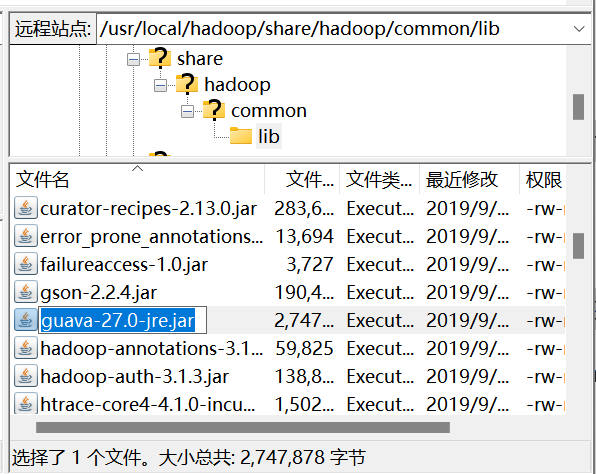

```shell
/usr/local/hive/lib
```

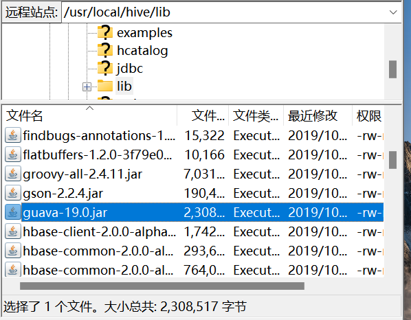

再次启动hive：

```shell
cd /usr/local/hive
./bin/hive
```

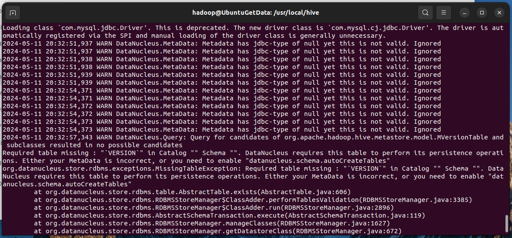

【错误】org.datanucleus.store.rdbms.exceptions.MissingTableException: Required table missing : “VERSION” in Catalog “” Schema “”. DataNucleus requires this table to perform its persistence operations.

【解决方案】

进入hive安装目录（比如/usr/local/hive），执行如下命令：

```shell
./bin/schematool -dbType mysql -initSchema
```

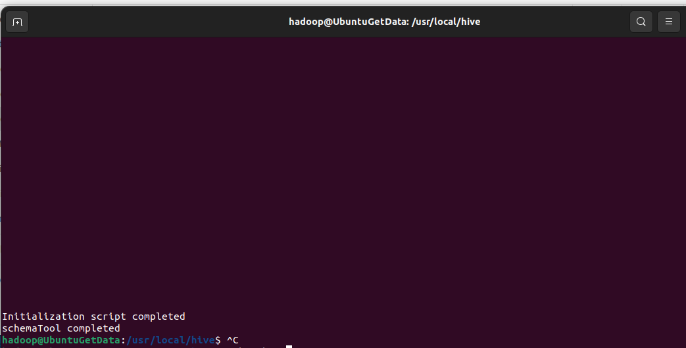

## Task 2 数据文件上传HDFS并合并

### Step 1 数据上传HDFS

发送数据到虚拟机

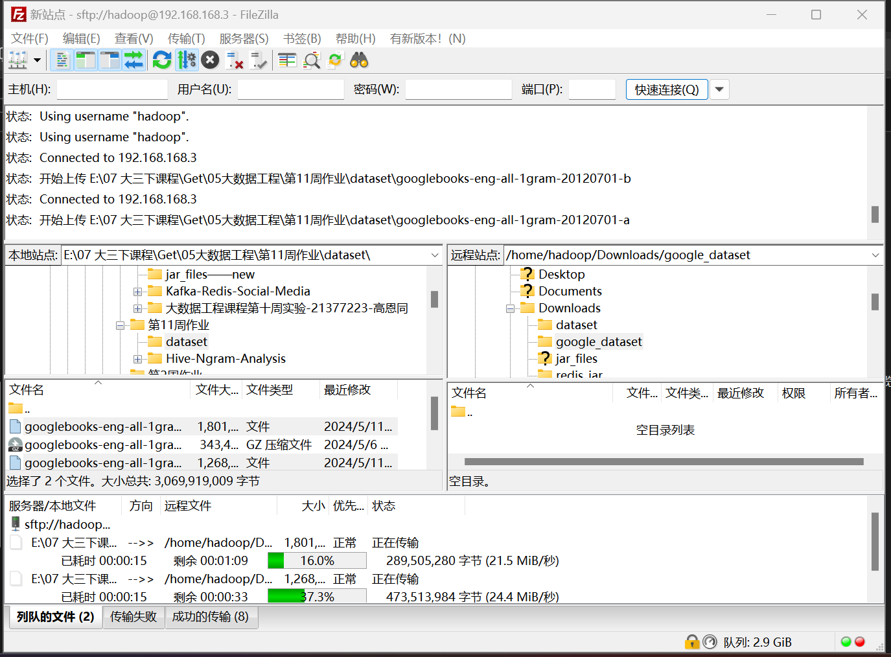

执行以下命令将数据集上传到HDFS：

```shell
./bin/hdfs dfs -mkdir -p /user/hive/data
./bin/hdfs dfs -put /home/hadoop/Downloads/google_dataset/googlebooks-eng-all-1gram-20120701-a /user/hive/data
./bin/hdfs dfs -put /home/hadoop/Downloads/google_dataset/googlebooks-eng-all-1gram-20120701-b /user/hive/data
```

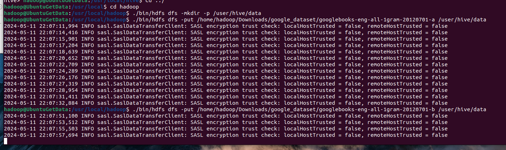

### Step 2 创建Hive表并插入数据

创建数据表命令：

```sql
CREATE TABLE IF NOT EXISTS ngrams (
    bigram STRING,
    year INT,
    match_count INT,
    volume_count INT
)
ROW FORMAT DELIMITED
FIELDS TERMINATED BY '\t'
STORED AS TEXTFILE;

```

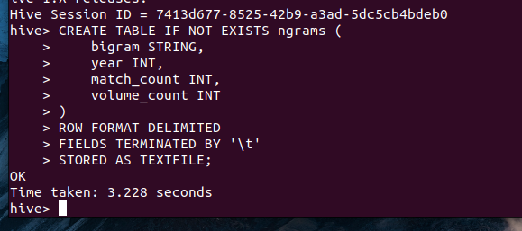

数据表创建成功！

加载数据到Hive：

```sql
LOAD DATA INPATH '/user/hive/data' INTO TABLE ngrams;
```

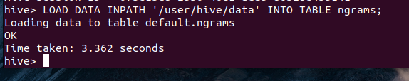

查看部分载入结果：

```sql
select * from ngrams limit 20;
```

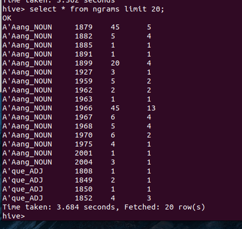

## Task 3 计算bigram年均次数

### Step 1 SQL命令

通过集函数查询加创建表实现：

```sql
CREATE TABLE IF NOT EXISTS bigram_averages (
    bigram STRING,
    average_match_count FLOAT
)
STORED AS ORC;

INSERT INTO TABLE bigram_averages
SELECT 
    bigram,
    SUM(match_count) / COUNT(DISTINCT year) AS average_match_count
FROM 
    ngrams
GROUP BY 
    bigram;
```

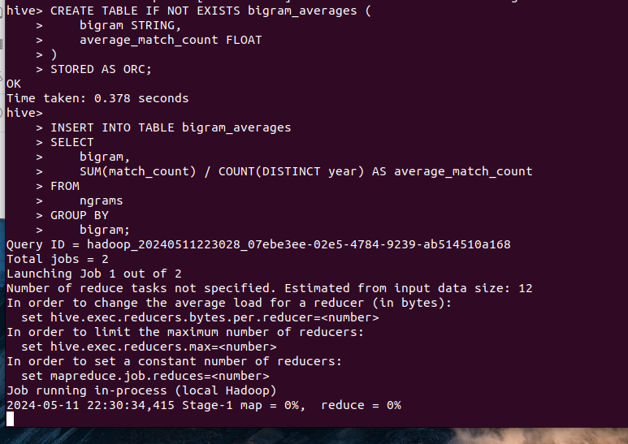

### Step 2 解除资源限制

在这里由于资源受到限制，无法完成任务，解决方法：关闭hadoop的安全模式

```shell
hdfs dfsadmin -safemode leave
```

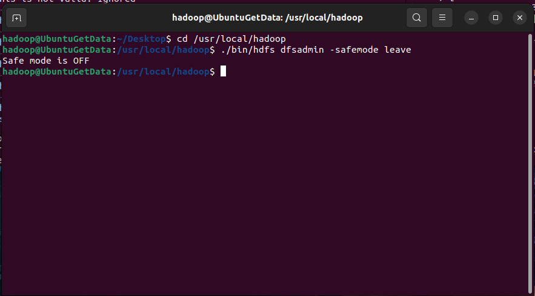

解除安全模式后注意进行重启：

```shell
./sbin/stop-dfs.sh
./sbin/start-dfs.sh
```

查看结果：

```sql
select * from bigram_averages limit 30
```

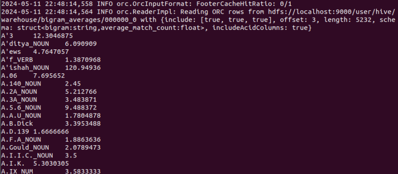

## Task 4 排序输出

首先创建Hive以存储数据：

```sql
CREATE TABLE IF NOT EXISTS top_bigrans(
	year INT
	bigran STRING
	average_natch_count FLOAT
)
STORED AS ORC;
```

将每年平均出现次数最高的20个bigram（按平均值降序排列）保存在Hive中：

```sql
INSERT INTO TABLE top_bigrams
SELECT
	year, bigram, average_match_count
FROM (
	SELECT
		year,
    	bigram,
    	AVG(match_count)As average_match_count,
    	ROW NUMBER()OVER(PARTITION BY year ORDER BY AVG(match_count) DESc)AS rn
	FROM (
		SELECT
			bigram,
			year,
			match_count
		FROM
			ngrams
		LIMIT 100000
    )As limited
    GROUP BY
		year, bigram
)AS ranked
WHERE rN <= 20;
```

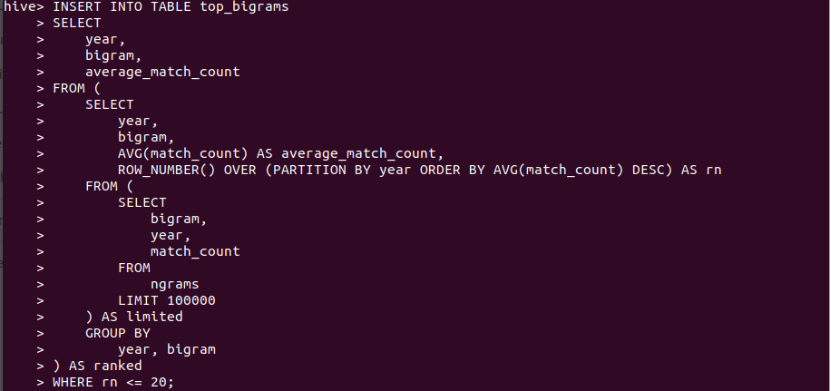

查询数据表top_bigrams

```sql
select * from top_bigrams limit 30
```

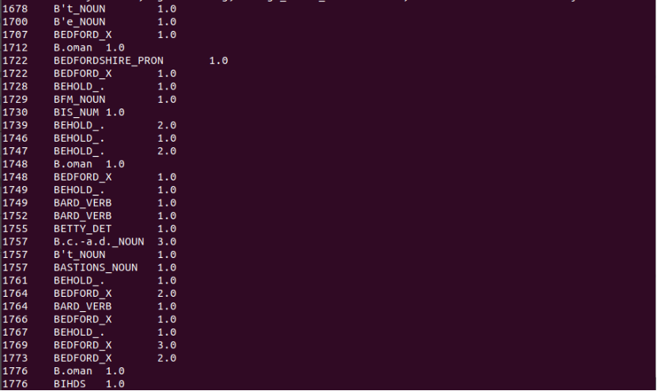

查询成功！
